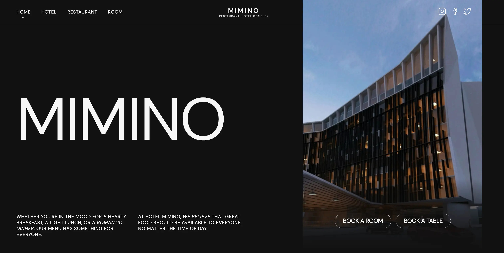

# MIMINO Hotel Website 


MIMINO is an immersive multi-page website designed to showcase the hotel and its
exceptional range of services, providing visitors with a captivating experience
of its unique atmosphere.

## Table of Contents

- [Description](#description)
- [Features](#features)
- [Technologies Used](#technologies-used)
- [Achievements](#achievements)
- [Project Type](#project-type)
- [Project Goal](#project-goal)
- [Getting Started](#getting-started)
- [Usage](#usage)

## Description

Welcome to MIMINO, a multi-page website that takes you on a journey through the
splendor of our hotel and its exceptional offerings. Immerse yourself in the
elegance and comfort we offer, all showcased through this dynamic website.

## Features

- Captivating and responsive design
- Visually appealing animations using Animate.css
- Clear and intuitive navigation menus
- Seamless compatibility across various devices

## Technologies Used

Using HTML, CSS, and JS, we developed a visually consistent and responsive
design, and used the Animate.css library for animation effects.


## Achievements

- Utilized responsive design principles to ensure a seamless website experience across devices, increasing accessibility and user satisfaction on desktops, tablets, and smartphones.
- Integrated various technologies and libraries, such as CSS frameworks and JS plugins, which improved the functionality and visual appeal of the website. Smart integration of resources contributed to the creation of a well-optimized and seamless platform.
- Successful work of the development team, which led to the timely implementation of the project.

## Project Type

MIMINO is a multi-page website that offers comprehensive information about the
hotel and its services, providing potential customers with an immersive
experience of the hotel's offerings.

## Project Goal

The primary objective of this project was to establish a strong online presence
for the hotel, showcasing its services and captivating potential customers.

## Getting Started

To view the MIMINO Hotel website locally, follow these steps:

1. Clone this repository:

   ```bash
   git clone https://github.com/vasylkivt/MIMINO.git
   ```

2. Make sure you have the LTS version of Node.js installed on your computer.
   [Download and install](https://nodejs.org/en/) it if needed.
3. Install the basic project dependencies by running `npm install` in your
   terminal.
4. Start the development mode by executing `npm start` in your terminal.
5. Open your web browser and go to
   [ http://localhost:5173/](http://localhost:5173/). The page will
   automatically refresh whenever you save changes to project files.

## Usage

Feel free to explore the website's pages, animations, and responsive design. You
can also use this project as a reference for implementing similar features in
your own projects.
